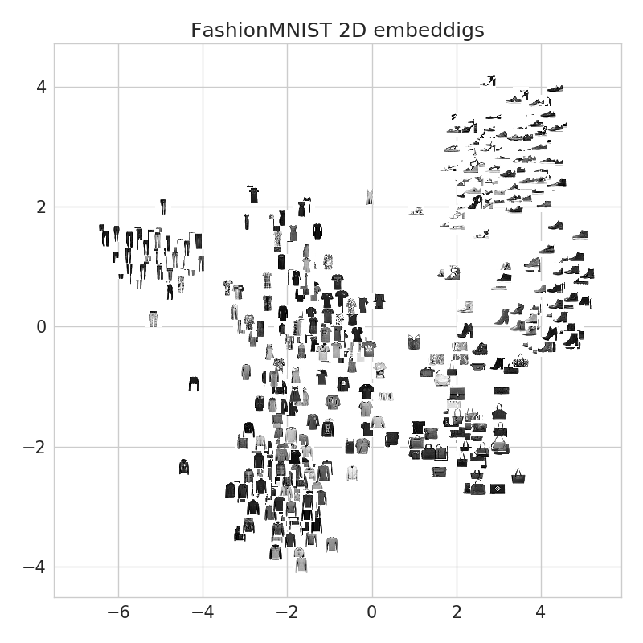

# Siamese Network with FashionMNIST
PyTorch implementation of Siamese Network with FashionMNIST.


## Dependencies
- python3
- pytorch==0.3.0
- torchvision=2.0

## Train Siamese Network
```
python train.py --lr 0.01 --epochs 20 --batch_size 128
```

## Visualize
```
python visualize.py --n_plots 500
```

## Reference
- https://www.cs.cmu.edu/~rsalakhu/papers/oneshot1.pdf
- https://arxiv.org/abs/1708.07747
- https://github.com/ywpkwon/siamese_tf_mnist
- https://hackernoon.com/facial-similarity-with-siamese-networks-in-pytorch-9642aa9db2f7
